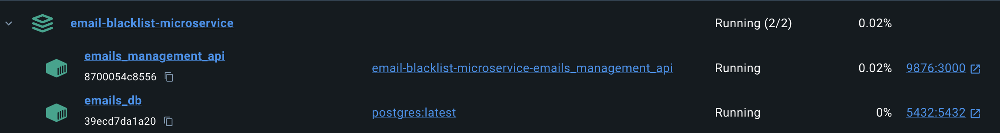

# Microservicio para controlar lista negra de correos electrónicos

## Índice

1. [Creación base de datos con Docker (opcional)](#creación-base-de-datos-con-docker-opcional)
2. [Registrar configuración de la base de datos](#registrar-configuración-de-la-base-de-datos)
3. [Ejecución](#ejecución)
4. [Uso](#uso)
5. [Pruebas](#pruebas)


## Creación base de datos con Docker (opcional)

Para crear la base de datos, se debe ejecutar el siguiente comando:

```bash
docker pull postgres
docker run --name db -p 5432:5432 -e POSTGRES_PASSWORD=postgres -d postgres
```

Ahora, para conectarse al contenedor y crear una nueva base de datos, proceda con la ejecución de los siguientes comandos:
```bash
docker exec -it db psql -U postgres
```

Para crear la base de datos dentro del contenedor:
```sql
CREATE USER admin_db;
CREATE DATABASE blacklist_db OWNER admin_db;
ALTER USER admin_db WITH PASSWORD 'admin_db';
exit
```

## Registrar configuración de la base de datos

Si ya tiene una base de datos creada, puede saltarse el paso anterior. 

Se deben registrar las credenciales de la base de datos en el archivo `.env` en la raíz del proyecto. A continuación, se muestra un ejemplo de cómo se debe registrar la información:

```bash
DB_USER=admin_db
DB_PASSWORD=admin_db
DB_HOST=localhost
DB_PORT=5432
DB_NAME=blacklist_db
SECRET_KEY=qwerty
```

## Ejecución

### Ejecución local (desde archivos fuente):

Debe instalar las dependencias del proyecto antes de ejecutarlo. Se recomienda usar un entorno virtual.

> ```bash
> pip install --upgrade pip
> pip install -r requirements.txt
> ```

Ejecución de la aplicación de forma local. La aplicación se ejecutará en el puerto `9876`:

> ```bash
> FLASK_APP=./application.py flask run -h 0.0.0.0 -p 9876
> ```

### Ejecución 🐳 docker-compose:

Con docker-compose solo debe ejecutar el siguiente comando en la raiz del proyecto:

> ```bash
> docker-compose up .
> ```

Si desea configurar puertos y palabra clave diferente puede modificar el archivo ```docker-compose.yml```



## Uso

El objetivo de este microservicio es que cientos de sistemas internos puedan consultar si un email está en la lista negra global de la empresa o no, así como agregar emails a la lista negra global.

Para usar el microservicio se deben hacer peticiones a la ruta `/blacklists` con los métodos `POST` o `GET`.

### Endpoints
- > `POST /blacklists/ping`: Verifica que el microservicio esté en ejecución.
  - > ``` curl --location 'http://localhost:9876/blacklists/ping' ```
- Más información del contrato con información de cada servicio :arrow_right: [acá](http://www.google.com) :arrow_left:


## Pruebas

Para ejecutar las pruebas unitarias de los microservicios y establecer el porcentaje mínimo de cobertura del conjunto de pruebas en 70%, ejecuta el siguiente comando desde la carpeta `email-blacklist-microservice`:
> ```
> pytest --cov-fail-under=70 --cov=src
> pytest --cov-fail-under=70 --cov=src --cov-report=html
> ```

Este último comando crea una página HTML (`index.html`) con el reporte de cobertura de las pruebas en la carpeta `htmlcov` que se encuentra en la raíz de `email-blacklist-microservice`.

:warning: No olvides instalar las dependencias
> ``` bash
> pip install pytest pytest-cov
> ```
